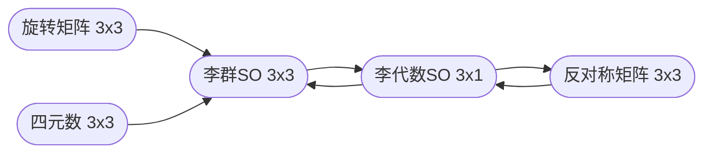
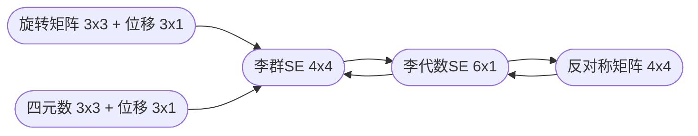

# Sophus模块

## 1 简介
Sophus 是李代数库，含有SO(3)、SE(3) 、 SO(2)、SE(2)、Sim(3) 等内容（Sim(3)是相似变换）；
### 1.1 安装
[下载点击这里](https://github.com/strasdat/Sophus)，直接用 cmake 编译安装；

- 注意
在ubuntu16中编译时会提示 `Eigen3 version 3.2.92 found in /usr/include/eigen3, but at least version 3.3.0 is required`，表示 Eigen3 版本较低，需要升级，方法参考[此链接](https://askubuntu.com/questions/1068232/how-to-update-libeigen3-to-version-3-3-on-16-04-xenial)；
安装完成后，如果自己的代码工程使用的是 cmake 编译，可能会报错说 c++ 版本不对：
```
/usr/include/c++/5/bits/c++0x_warning.h:32:2: error: #error This file requires compiler and library support for the ISO C++ 2011 standard. This support must be enabled with the -std=c++11 or -std=gnu++1
（ 后面还有一大堆错误说找不到某种定义）
```
这时只需要在 CMakeList.txt 文件中添加一句：
```shell
SET(CMAKE_CXX_FLAGS "-std=c++11 -O3")
```

## 2 李群与李代数中的数据转换
旋转矩阵、四元数等数据可以使用 Eigen 模块来产生（[点击查看](http://www.tamray.cn/index.php/2020/08/08/eigen/)），李群、李代数、反对称矩阵等数据类型的转换可以参考以下代码：


```cpp
#include <iostream>
#include <cmath>
#include <Eigen/Core>
#include <Eigen/Geometry>
#include <sophus/se3.hpp>


int main(int argc, char **argv) {
    std::cout << "=============== SO(3) ================" << std::endl;
    std::cout << "(旋转矩阵)" << std::endl;
    Eigen::Matrix3d R = Eigen::AngleAxisd(M_PI / 4, Eigen::Vector3d(0, 0, 1)).toRotationMatrix();
    std::cout << R << std::endl;
    std::cout << "\n(四元数)" << std::endl;
    Eigen::Quaterniond q(R);
    std::cout << q.matrix() << std::endl;

    std::cout << "\n1. 李群 <-- 旋转矩阵 or 四元数" << std::endl;
    Sophus::SO3d SO3_R(R);
    //Sophus::SO3d SO3_R(q);
    std::cout << SO3_R.matrix() << std::endl;

    std::cout << "\n2. 李代数 <-- 李群" << std::endl;
    Eigen::Vector3d so3 = SO3_R.log();
    std::cout << so3.matrix() << std::endl;

    std::cout << "\n3. 反对称矩阵 <-- 李代数" << std::endl;
    Eigen::Matrix3d so3_hat = Sophus::SO3d::hat(so3);
    std::cout << so3_hat << std::endl;

    std::cout << "\n4. 李代数 <-- 反对称矩阵" << std::endl;
    Eigen::Vector3d so3_hat_vee = Sophus::SO3d::vee(so3_hat);
    std::cout << so3_hat_vee << std::endl;


    std::cout << "\n5. 李群 <-- 李代数" << std::endl;
    Eigen::Vector3d so3_min(1e-4, 0, 0);
    Sophus::SO3d SO3_min = Sophus::SO3d::exp(so3_min);
    std::cout << SO3_min.matrix() << std::endl;

    std::cout << "\n6. 李群左乘小变量" << std::endl;
    Sophus::SO3d SO3_update = SO3_min * SO3_R;
    std::cout << SO3_update.matrix() << std::endl;


    std::cout << "\n\n=============== SE(3) ================" << std::endl;
    std::cout << "(位移)" << std::endl;
    Eigen::Vector3d t(1, 0, 0);
    std::cout << t << std::endl;


    std::cout << "\n1. 李群 <-- (旋转矩阵 or 四元数) and 位移" << std::endl;
    Sophus::SE3d SE3_Rt(R, t);
    //Sophus::SE3d SE3_Rt(q, t);
    std::cout << SE3_Rt.matrix() << std::endl;

    std::cout << "\n2. 李代数 <-- 李群" << std::endl;
    Eigen::Matrix<double, 6, 1> se3 = SE3_Rt.log();
    std::cout << se3 << std::endl;

    std::cout << "\n3. 反对称矩阵 <-- 李代数" << std::endl;
    Eigen::Matrix<double, 4, 4> se3_hat = Sophus::SE3d::hat(se3);
    std::cout << se3_hat << std::endl;

    std::cout << "\n4. 李代数 <-- 反对称矩阵" << std::endl;
    Eigen::Matrix<double, 6, 1> se3_hat_vee = Sophus::SE3d::vee(se3_hat);
    std::cout << se3_hat_vee << std::endl;

    std::cout << "\n5. 李群 <-- 李代数" << std::endl;
    Eigen::Matrix<double, 6, 1> se3_min;
    se3_min.setZero();
    se3_min(0, 0) = 1e-4;
    Sophus::SE3d SE3_min =  Sophus::SE3d::exp(se3_min);
    std::cout << SE3_min.matrix() << std::endl;

    std::cout << "\n6. 李群左乘小变量" << std::endl;
    Sophus::SE3d SE3_update = SE3_min * SE3_Rt;
    std::cout << SE3_update.matrix() << std::endl;


    return 0;
}
```

