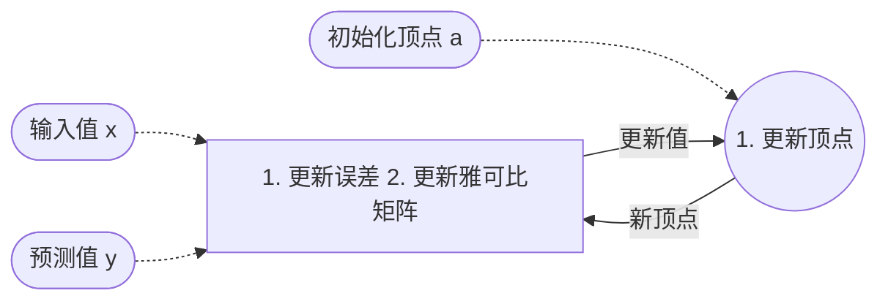

<script>
(function(){
    var bp = document.createElement('script');
    var curProtocol = window.location.protocol.split(':')[0];
    if (curProtocol === 'https'){
   bp.src = 'https://zz.bdstatic.com/linksubmit/push.js';
  }
  else{
  bp.src = 'http://push.zhanzhang.baidu.com/push.js';
  }
    var s = document.getElementsByTagName("script")[0];
    s.parentNode.insertBefore(bp, s);
})();
</script>


## 1简介
g2o 是一个基于图优化的库，是为了更直观的体现出优化模型的形态，看出各个优化变量和误差项的关联；图优化由顶点和边构成，其中，`顶点`表示`优化变量`，`边`表示`误差项`，于是，对于任意一个非线性最小二乘问题，我们可以构建与之对应的的一个包含顶点和边的`图`；

## 2 安装
先安装以下库：
```shell
sudo apt install qt5-qmake qt5-default libqglviewer-dev-qt5 libsuitesparse-dev libcxsparse3 libcholmod3
```
然后下载源码（[地址](https://github.com/RainerKuemmerle/g2o)），用 cmake 安装，默认安装在 `/usr/local/lib` 下，

## 3 使用实例
### 3.1 案例1

- 目标:
  
  拟合以下曲线：
     $$ y = exp(ax^2 + bx + c) + w $$
  在这个方程中，$x$ 为一批输入值，$y$ 为一批观测值，$w$ 为随机噪声，而参数 $a$、$b$、$c$ 是未知，我们的目标就是优化它从而拟合该曲线方程；
	
- 分析

  我们可以将此问题转换为一个最小二乘问题：
  $$min \frac{1}{2} \sum_{i=1}^{N} || y_i  - exp(ax_i^2 + bx_i + c)||^2 $$
  在这个最小二乘问题中，我们定义误差为：
  $$e_i = y_i - exp(ax_i^2 + bx_i + c)$$
  然后求出误差对参数的偏导：
  $$ \frac{\partial{e_i}}{\partial{a}} =  -x_i^2exp(ax_i^2 + bx_i + c) $$
  $$ \frac{\partial{e_i}}{\partial{b}} =  -x_iexp(ax_i^2 + bx_i + c) $$
  $$ \frac{\partial{e_i}}{\partial{c}} =  -exp(ax_i^2 + bx_i + c) $$
  于是，$J = \begin{bmatrix}  \frac{\partial{e_i}}{\partial{a}},  \frac{\partial{e_i}}{\partial{a}},  \frac{\partial{e_i}}{\partial{a}} \end{bmatrix}^T$，高斯牛顿的增量方程为：
  $$ (\sum_{i=1}^{N} J_i J_i^T) \Delta a = \sum_{i=1}^{N} -J_i e_i $$
  其中，$\Delta a$ 就是需要迭代产生的参数更新量；

- 模型

- 代码
:::details
```cpp
#include <iostream>
#include <g2o/core/g2o_core_api.h>
#include <g2o/core/base_vertex.h>
#include <g2o/core/base_unary_edge.h>
#include <g2o/core/block_solver.h>
#include <g2o/core/optimization_algorithm_levenberg.h>
#include <g2o/core/optimization_algorithm_gauss_newton.h>
#include <g2o/core/optimization_algorithm_dogleg.h>
#include <g2o/solvers/dense/linear_solver_dense.h>
#include <Eigen/Core>
#include <opencv2/core/core.hpp>
#include <cmath>
#include <chrono>

// 顶点模型
class CurveFittingVertex : public g2o::BaseVertex<3, Eigen::Vector3d> { // 采用顶点模板，并设置维度、类型
public:
    EIGEN_MAKE_ALIGNED_OPERATOR_NEW

    // 重置顶点
    virtual void setToOriginImpl() override {
        _estimate << 0, 0, 0;
    }

    // 更新顶点
    virtual void oplusImpl(const double *update) override {
        _estimate += Eigen::Vector3d(update);
    }

    virtual bool read(std::istream &in) {}
    virtual bool write(std::ostream &out) const {}
};

// 误差模型
class CurveFittingEdge : public g2o::BaseUnaryEdge<1, double, CurveFittingVertex> {
public:
    EIGEN_MAKE_ALIGNED_OPERATOR_NEW

    CurveFittingEdge(double x) : BaseUnaryEdge(), _x(x) {}

    // 更新误差
    virtual void computeError() override {
        const CurveFittingVertex *v = static_cast<const CurveFittingVertex *> (_vertices[0]);
        const Eigen::Vector3d abc = v->estimate();
        _error(0, 0) = _measurement - std::exp(abc(0,0)*_x*_x + abc(1, 0)*_x + abc(2, 0));
    }

    // 更新雅可比
    virtual void linearizeOplus() override {
        const CurveFittingVertex *v = static_cast<const CurveFittingVertex *> (_vertices[0]);
        const Eigen::Vector3d abc = v->estimate();
        double y = exp(abc[0]*_x*_x + abc[1]*_x + abc[2]);
        _jacobianOplusXi[0] = -_x * _x * y;
        _jacobianOplusXi[1] = -_x * y;
        _jacobianOplusXi[2] = -y;
    }

    virtual bool read(std::istream &in) {}
    virtual bool write(std::ostream &out) const {}

public:
    double _x;
};


int main()
{
    double ar = 3.0, br = 4.0, cr = 1.0; // 真实参数
    double ae = 1.0, be = 3.0, ce = 2.0; // 预测参数
    int N = 100; // 数据个数
    double w_sigma = 1.0; // 数据的噪声
    double inv_sigma = 1.0 / w_sigma; // w_sigma^-1

    // 生成数据
    cv::RNG rng;
    std::vector<double> x_data, y_data;
    for (int i = 0; i < N; i++) {
        double x = i / 100.0;
        x_data.push_back(x);
        y_data.push_back(exp(ar*x*x + br*x + cr) 
                         + rng.gaussian(w_sigma*w_sigma));
    }


    // 设定g2o
    typedef g2o::BlockSolver<g2o::BlockSolverTraits<3, 1>> BlockSolverType; // 顶点类型
    typedef g2o::LinearSolverDense<BlockSolverType::PoseMatrixType> LinearSolverType; // 边类型

    auto solver = new g2o::OptimizationAlgorithmGaussNewton( // 求解器
        g2o::make_unique<BlockSolverType>(g2o::make_unique<LinearSolverType>()));
    
    g2o::SparseOptimizer optimizer; // 图模型
    optimizer.setAlgorithm(solver); //   设置求解器
    optimizer.setVerbose(true);     //   打开调试输出

    // 增加顶点
    CurveFittingVertex *v = new CurveFittingVertex();
    v->setEstimate(Eigen::Vector3d(ae, be, ce)); // 待优化的参数设为顶点
    v->setId(0);
    optimizer.addVertex(v);

    // 增加边
    for (int i = 0; i < N; i++) {
        CurveFittingEdge * edge = new CurveFittingEdge(x_data[i]); // 输入值
        edge->setId(i);
        edge->setVertex(0, v); // 顶点
        edge->setMeasurement(y_data[i]); // 观测值
        edge->setInformation(Eigen::Matrix<double, 1, 1>::Identity() * inv_sigma);
        optimizer.addEdge(edge);
    }

    optimizer.initializeOptimization();
    optimizer.optimize(10);

    Eigen::Vector3d abc_estimate = v->estimate();
    std::cout << abc_estimate.transpose() << std::endl;

    return 0;
}
```
:::


### 3.2 案例2
- 已知：
  
  两幅图像已经匹配的特征点若干，其中一幅图的点为 3d 点 $P_1$，另一副图的点为 2d 点 $u_1$。

- 目标：
  
  求这两幅图片之间的位姿变换 $T$。

- 分析：
  
  在此问题中，$P_1$ 点经过位姿变换会得到对应的 2d 点像素坐标 $u_1'$，但是 $u_1'$ 和 $u_1$ 有偏差，我们需要最小化这个误差，从而找到最优值 $T$。所以可以得到最小二乘问题：
  $$T^*  = \arg \min_{T}\frac{1}{2}\sum_{i=1}^{n}\|u_i - \frac{1}{s_i}KTP_i \|_2^2$$
  在这个问题中，要计算的雅可比 $J$ 是`误差对位姿 $T$ 的导数`：
  $$ J = - \begin{bmatrix} 
  \frac{f_x}{Z'} & 0 & -\frac{f_xX'}{{Z'}^2} & -\frac{f_xX'Y'}{{Z'}^2} & f_x+\frac{f_x{X'}^2}{{Z'}^2} & -\frac{f_xY'}{Z'} \\
  0 & \frac{f_y}{Z'} & -\frac{f_yY'}{{Z'}^2} & -f_y-\frac{f_y{Y'}^2}{{Z'}^2} & \frac{f_yX'Y'}{{Z'}^2} & \frac{f_yX'}{Z'} 
  \end{bmatrix}$$
  然后用 $J$ 计算梯度 $\Delta T$：
  $$ (\sum_{i=1}^{N} J_i J_i^T) \Delta T = \sum_{i=1}^{N} -J_i e_i $$
  在g2o中，$\Delta T$ 用来更新顶点。顶点与边的关系如图：
  
  

- 代码
:::details
```cpp
// 顶点
class VertexPose : public g2o::BaseVertex<6, Sophus::SE3d> {
public:
    EIGEN_MAKE_ALIGNED_OPERATOR_NEW;

    // 初始化顶点
    virtual void setToOriginImpl() override {
        _estimate = Sophus::SE3d();
    }

    // 更新顶点：李群左乘小变量
    virtual void oplusImpl(const double *update) override {
        Eigen::Matrix<double, 6, 1> update_eigen;
        update_eigen << update[0], update[1], update[2], update[3], update[4], update[5];
        _estimate = Sophus::SE3d::exp(update_eigen) * _estimate;
    }

    virtual bool read(istream &in) override {}
    virtual bool write(ostream &out) const override {}
};

// 边
class EdgeProjection : public g2o::BaseUnaryEdge<2, Eigen::Vector2d, VertexPose> {
public:
    EIGEN_MAKE_ALIGNED_OPERATOR_NEW;

    EdgeProjection(const Eigen::Vector3d &pos, const Eigen::Matrix3d &K) : _pos3d(pos), _K(K) {} // 传入参数：3d点坐标、K

    // 计算误差
    virtual void computeError() override {
        const VertexPose *v = static_cast<VertexPose *> (_vertices[0]);
        Sophus::SE3d T = v->estimate();
        Eigen::Vector3d pos_pixel = _K * (T * _pos3d);
        pos_pixel /= pos_pixel[2];
        _error = _measurement - pos_pixel.head<2>();
    }

    // 计算雅可比
    virtual void linearizeOplus() override {
        const VertexPose *v = static_cast<VertexPose *> (_vertices[0]);
        Sophus::SE3d T = v->estimate();
        Eigen::Vector3d pos_cam = T * _pos3d;
        double fx = _K(0, 0);
        double fy = _K(1, 1);
        double cx = _K(0, 2);
        double cy = _K(1, 2);
        double X = pos_cam[0];
        double Y = pos_cam[1];
        double Z = pos_cam[2];
        double Z2 = Z * Z;
        _jacobianOplusXi
          << -fx / Z, 0, fx * X / Z2, fx * X * Y / Z2, -fx - fx * X * X / Z2, fx * Y / Z,
          0, -fy / Z, fy * Y / (Z * Z), fy + fy * Y * Y / Z2, -fy * X * Y / Z2, -fy * X / Z;
    }

    virtual bool read(istream &in) override {}
    virtual bool write(ostream &out) const override {}

private:
    Eigen::Vector3d _pos3d;
    Eigen::Matrix3d _K;
};


// 建图
void bundleAdjustmentG2O(
    const VecVector3d &points_3d, // 3d点坐标
    const VecVector2d &points_2d, // 2d点坐标
    const Mat &K,                 // 内参
    Sophus::SE3d &pose) {         // 位姿（优化对象）

    // 构建图优化，先设定g2o
    typedef g2o::BlockSolver<g2o::BlockSolverTraits<6, 3>> BlockSolverType;  // pose is 6, landmark is 3
    typedef g2o::LinearSolverDense<BlockSolverType::PoseMatrixType> LinearSolverType; // 线性求解器类型
    // 梯度下降方法，可以从GN, LM, DogLeg 中选
    auto solver = new g2o::OptimizationAlgorithmGaussNewton(
    g2o::make_unique<BlockSolverType>(g2o::make_unique<LinearSolverType>()));
    g2o::SparseOptimizer optimizer;     // 图模型
    optimizer.setAlgorithm(solver);   // 设置求解器
    optimizer.setVerbose(true);       // 打开调试输出

    // 设置顶点
    VertexPose *vertex_pose = new VertexPose(); // camera vertex_pose
    vertex_pose->setId(0);
    vertex_pose->setEstimate(Sophus::SE3d());
    optimizer.addVertex(vertex_pose);

    // 创建内参K
    Eigen::Matrix3d K_eigen;
    K_eigen <<
            K.at<double>(0, 0), K.at<double>(0, 1), K.at<double>(0, 2),
        K.at<double>(1, 0), K.at<double>(1, 1), K.at<double>(1, 2),
        K.at<double>(2, 0), K.at<double>(2, 1), K.at<double>(2, 2);

    // 设置边
    int index = 1;
    for (size_t i = 0; i < points_2d.size(); ++i) {
        auto p2d = points_2d[i];
        auto p3d = points_3d[i];
        EdgeProjection *edge = new EdgeProjection(p3d, K_eigen);
        edge->setId(index);
        edge->setVertex(0, vertex_pose);
        edge->setMeasurement(p2d);
        edge->setInformation(Eigen::Matrix2d::Identity());
        optimizer.addEdge(edge);
        index++;
    }

    chrono::steady_clock::time_point t1 = chrono::steady_clock::now();
    optimizer.setVerbose(true);
    optimizer.initializeOptimization();
    optimizer.optimize(10);
    chrono::steady_clock::time_point t2 = chrono::steady_clock::now();
    chrono::duration<double> time_used = chrono::duration_cast<chrono::duration<double>>(t2 - t1);
    cout << "optimization costs time: " << time_used.count() << " seconds." << endl;
    cout << "pose estimated by g2o =\n" << vertex_pose->estimate().matrix() << endl;
    pose = vertex_pose->estimate();
}
```
:::

- 图优化
  


### 3.3 案例3


