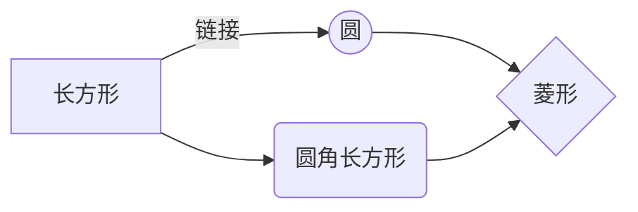
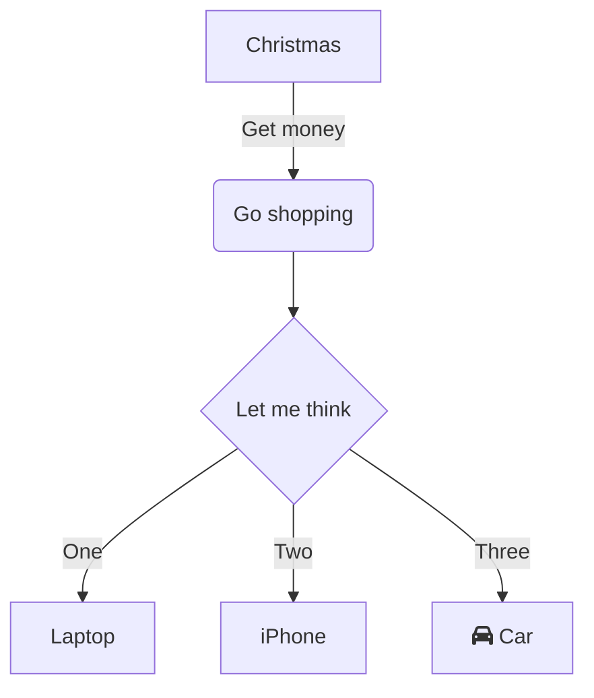
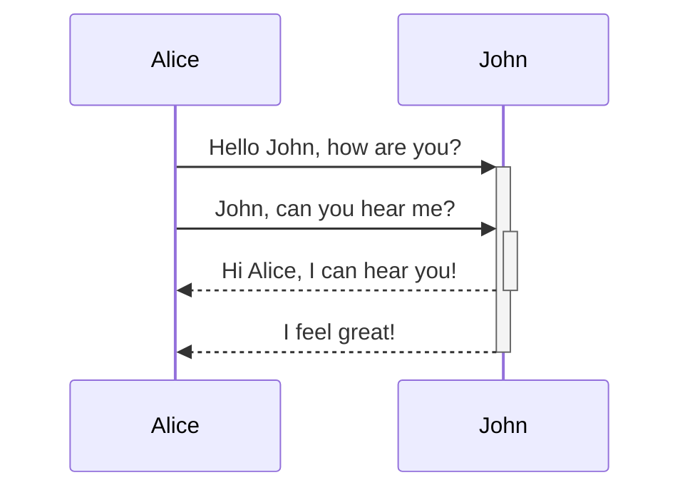
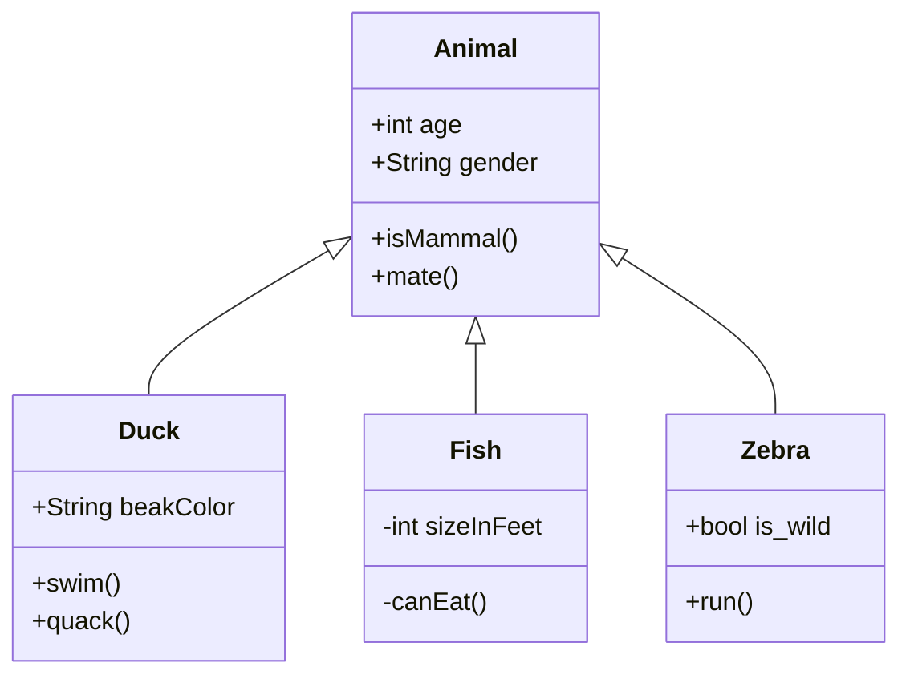
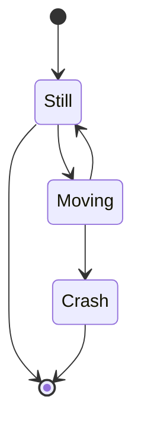
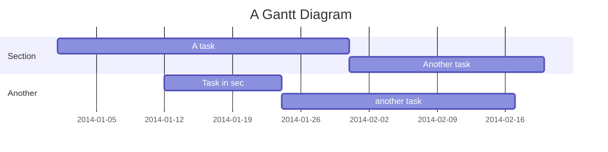
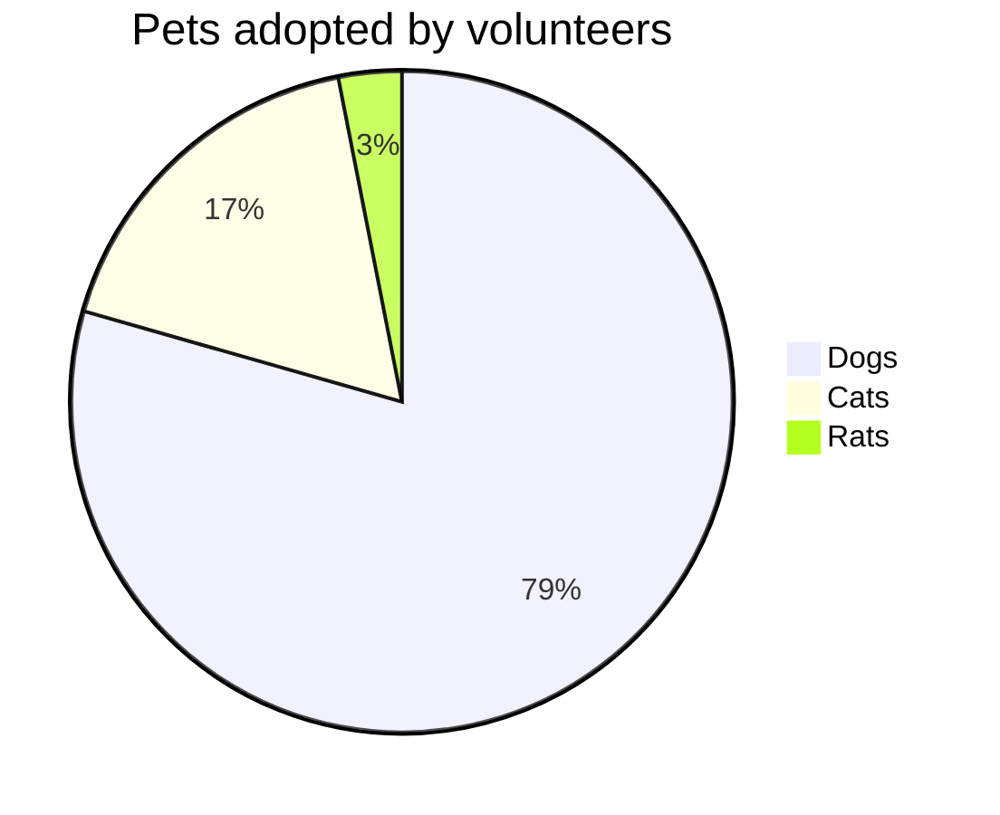

# 绘图Demo


mermaid图的绘制参考[这里](https://mermaid-js.github.io/mermaid/#/)


### Mermaid流程图
（mermaid）
```shell
graph LR
A[长方形] -- 链接 --> B((圆))
A --> C(圆角长方形)
B --> D{菱形}
C --> D
```

（mermaid）
```shell
graph TD
A[Christmas] -->|Get money| B(Go shopping)
B --> C{Let me think}
C -->|One| D[Laptop]
C -->|Two| E[iPhone]
C -->|Three| F[fa:fa-car Car]
```


### UML图
（mermaid）
```shell
sequenceDiagram
	Alice->>+John: Hello John, how are you?
	Alice->>+John: John, can you hear me?
	John-->>-Alice: Hi Alice, I can hear you!
	John-->>-Alice: I feel great!
```


### classDiagram类图
（mermaid）
```shell
classDiagram
	Animal <|-- Duck
	Animal <|-- Fish
	Animal <|-- Zebra
	Animal : +int age
	Animal : +String gender
	Animal: +isMammal()
	Animal: +mate()
	class Duck{
		+String beakColor
		+swim()
		+quack()
	}
	class Fish{
		-int sizeInFeet
		-canEat()
	}
	class Zebra{
		+bool is_wild
		+run()
	}
```


### stateDiagram图
（mermaid）
```shell
stateDiagram
	[*] --> Still
	Still --> [*]

	Still --> Moving
	Moving --> Still
	Moving --> Crash
	Crash --> [*]
```


### 甘特图
（mermaid）
```shell
gantt
	title A Gantt Diagram
	dateFormat  YYYY-MM-DD
	section Section
	A task           :a1, 2014-01-01, 30d
	Another task     :after a1  , 20d
	section Another
	Task in sec      :2014-01-12  , 12d
	another task      : 24d
```


### 饼图
（mermaid）
```shell
pie title Pets adopted by volunteers
	"Dogs" : 386
	"Cats" : 85
	"Rats" : 15
```



### 线图

- 在终端执行：
  ```shell
  yarn add markmap-lib -D
  ```
- 单独编写一个md文件，比如文件 001.md:
  ```shelll
  # 我
  ## 人
  ### 高人
  ### 小人
  ## 不是人
  ### 猪猪
  ### 狗狗
  ```
- 终端操作该 md 文件：
  ```shell
  npx markmap-lib 001.md
  ```
- 此时会在当前目录产生 001.html 文件，里面就是想要的线图；

### 标准流程图

安装插件 `vuepress-plugin-flowchart`。

使用：
```
@flowstart ant
st=>start: Start:>http://www.google.com[blank]
e=>end:>http://www.google.com
op1=>operation: My Operation
sub1=>subroutine: My Subroutine
cond=>condition: Yes
or No?:>http://www.google.com
io=>inputoutput: catch something...
para=>parallel: parallel tasks

st->op1->cond
cond(yes)->io->e
cond(no)->para
para(path1, bottom)->sub1(right)->op1
para(path2, top)->op1
@flowend
```

@flowstart ant
st=>start: Start:>http://www.google.com[blank]
e=>end:>http://www.google.com
op1=>operation: My Operation
sub1=>subroutine: My Subroutine
cond=>condition: Yes
or No?:>http://www.google.com
io=>inputoutput: catch something...
para=>parallel: parallel tasks

st->op1->cond
cond(yes)->io->e
cond(no)->para
para(path1, bottom)->sub1(right)->op1
para(path2, top)->op1
@flowend